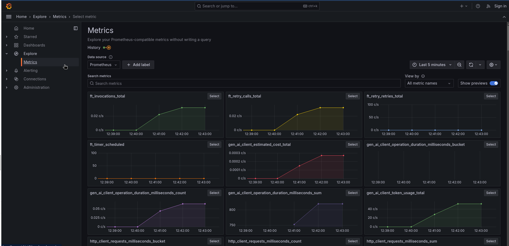
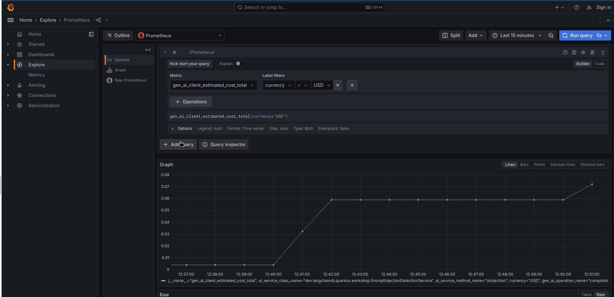
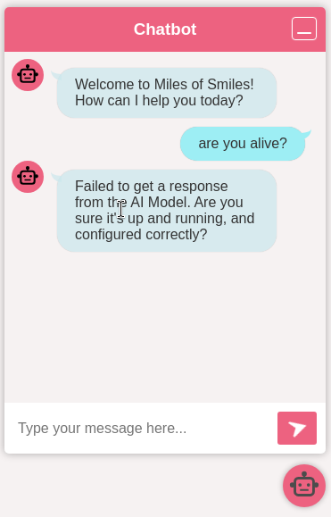

# Step 09 - Observability and Fault Tolerance

In the previous step we introduced guardrailing, allowing us to mitigate prompt injection using guardrails.
While it's certainly important to protect against prompt injection, it's also important to ensure that if
something goes wrong, we can quickly identify issues, and handle failures gracefully as well. 

For this,
we will add observability to our LLM interactions by implementing logging, tracing, and metrics to our application.
In addition, we will add fault tolerance to our LLM interactions by implementing retries and fallback mechanisms.

<!---->

## Observability

The 3 main pillars of observability are logging, tracing, and metrics.
In the following sections, we will explore how to implement observability to gain valuable insights into our
application's behavior, in particular with regards to its interactions with LLMs. Implemeting these features with
Quarkus is a straightforward process and can be easily integrated into your existing Quarkus applications.

The final code of this step is available in the `step-09` directory.

### Logging

To ensure that our LLM interactions are monitored and logged, we need to implement logging in our application.
This will allow us to track the input and output of each interaction with the model,
as well as any errors or exceptions that occur. As you might have noticed throughout this lab, you have in fact
already been logging interactions with the model in previous steps.

Go ahead and examine the application.properties file in the `src/main/resources` directory.
You will see 2 properties (if you don't see them, go ahead and add them):

```properties
quarkus.langchain4j.openai.chat-model.log-requests=true
quarkus.langchain4j.openai.chat-model.log-responses=true
```

The `log-requests` property enables logging of all requests made to the model,
while the `log-responses` property enables logging of all responses received from the model.
These logs provide valuable insights into how the LLM is interacting with your application and any issues that arise.
Go ahead and start up Quarkus Dev Mode if you haven't already with `./mvnw quarkus:dev` go to [http://localhost:8080](http://localhost:8080/){target="_blank"}
and open the chat interface in the bottom right of your screen. Send an instruction to the bot and then come
back to your console. You'll see a series requests/responses to/from the LLM with a bunch of information such as
the url, headers, and in the body, the model you called, the messages, temperature, tokens and more.

```Bash title="Example Log Output"
09:50:54 INFO  traceId=cb938581635e7777244c57bc4ece04db, parentId=d7888051b1772651, spanId=f92dfd63091f4efa, sampled=true [io.qu.la.op.co.OpenAiRestApi$OpenAiClientLogger] (vert.x-eventloop-thread-5) Request:
- method: POST
- url: https://api.openai.com/v1/chat/completions
- headers: [Accept: application/json], [Authorization: Be...1B], [Content-Type: application/json], [User-Agent: langchain4j-openai], [content-length: 2335]
- body: {
  "model" : "gpt-4o",
  "messages" : [ {
    "role" : "system",
    "content" : "You are a customer support agent of a car rental company 'Miles of Smiles'.\nYou are friendly, polite and concise.\nIf the question is unrelated to car rental, you should politely redirect the customer to the right department.\n\nToday is 2025-01-10.\n"
  }, {
    "role" : "user",
    "content" : "what services are available?\nPlease, only use the following information:\n- United States of America.\n2. The Services\n- from within any country in the world, of applications, websites, content, products, and services\n- liable for any modification, suspension or discontinuation of the Services.\n"
  } ],
  "temperature" : 1.0,
  "top_p" : 1.0,
  "max_tokens" : 1000,
  "presence_penalty" : 0.0,
  "frequency_penalty" : 0.0,
  "tools" : [ {
    "type" : "function",
    "function" : {
      "name" : "cancelBooking",
      "description" : "Cancel a booking",
      "parameters" : {
        "type" : "object",
        "properties" : {
          "bookingId" : {
            "type" : "integer"
          },
          "customerFirstName" : {
            "type" : "string"
          },
          "customerLastName" : {
            "type" : "string"
          }
        },
        "required" : [ "bookingId", "customerFirstName", "customerLastName" ]
      }
    }
  }, {
    "type" : "function",
    "function" : {
      "name" : "listBookingsForCustomer",
      "description" : "List booking for a customer",
      "parameters" : {
        "type" : "object",
        "properties" : {
          "customerName" : {
            "type" : "string"
          },
          "customerSurname" : {
            "type" : "string"
          }
        },
        "required" : [ "customerName", "customerSurname" ]
      }
    }
  }, {
    "type" : "function",
    "function" : {
      "name" : "getBookingDetails",
      "description" : "Get booking details",
      "parameters" : {
        "type" : "object",
        "properties" : {
          "bookingId" : {
            "type" : "integer"
          },
          "customerFirstName" : {
            "type" : "string"
          },
          "customerLastName" : {
            "type" : "string"
          }
        },
        "required" : [ "bookingId", "customerFirstName", "customerLastName" ]
      }
    }
  } ]
}

  09:50:55 INFO  traceId=cb938581635e7777244c57bc4ece04db, parentId=d7888051b1772651, spanId=f92dfd63091f4efa, sampled=true [io.qu.la.op.co.OpenAiRestApi$OpenAiClientLogger] (vert.x-eventloop-thread-5) Response:
- status code: 200
- headers: [Date: Fri, 10 Jan 2025 08:50:55 GMT], [Content-Type: application/json], [Transfer-Encoding: chunked], [Connection: keep-alive], [access-control-expose-headers: X-Request-ID], [openai-organization: user-qsgtnhp4stba6axsc0rzfyum], [openai-processing-ms: 1531], [openai-version: 2020-10-01], [x-ratelimit-limit-requests: 500], [x-ratelimit-limit-tokens: 30000], [x-ratelimit-remaining-requests: 499], [x-ratelimit-remaining-tokens: 28713], [x-ratelimit-reset-requests: 120ms], [x-ratelimit-reset-tokens: 2.572s], [x-request-id: req_33432b46a09d2e3e4918cdc085747825], [strict-transport-security: max-age=31536000; includeSubDomains; preload], [CF-Cache-Status: DYNAMIC], [Set-Cookie: __...ne], [X-Content-Type-Options: nosniff], [Set-Cookie: _c...ne], [Server: cloudflare], [CF-RAY: 8ffb6c11687983dd-BRU], [alt-svc: h3=":443"; ma=86400]
- body: {
  "id": "chatcmpl-Ao51CDrgIYFN25RIK4GJAdvQjp5tY",
  "object": "chat.completion",
  "created": 1736499054,
  "model": "gpt-4o-2024-08-06",
  "choices": [
    {
      "index": 0,
      "message": {
        "role": "assistant",
        "content": "Our car rental services, under the name \"Miles of Smiles,\" are available for users within the United States. These services include a variety of applications, websites, content, products, and services related to car rental. Please feel free to ask any specific questions about our car rental options!",
        "refusal": null
      },
      "logprobs": null,
      "finish_reason": "stop"
    }
  ],
  "usage": {
    "prompt_tokens": 228,
    "completion_tokens": 60,
    "total_tokens": 288,
    "prompt_tokens_details": {
      "cached_tokens": 0,
      "audio_tokens": 0
    },
    "completion_tokens_details": {
      "reasoning_tokens": 0,
      "audio_tokens": 0,
      "accepted_prediction_tokens": 0,
      "rejected_prediction_tokens": 0
    }
  },
  "service_tier": "default",
  "system_fingerprint": "fp_b7d65f1a5b"
}
```

By default the logs are output the console. In a production system the console output is typically forwarded
to a log aggregation service so logs can be centralized and searched in more advanced ways.
We'll take a look at a log collection system in a little bit, but first let's take a look at how to collect
metrics from our application.

### Metrics

It's also important to gain insight into the performance and behavior of our application
through the use of metrics and cold hard numbers. Using these metrics,
we can create meaningful graphs, dashboards and alerts.

The (currently) preferred way to gather metrics in Quarkus is to use the micrometer project.
You can add metrics collection with micrometer by adding the `quarkus-micrometer` extension to the pom.xml.
You then need to add a collector specific extension to format the metrics accordingly. In the below example
we have included the `quarkus-micrometer-registry-otlp` extension for the general purpose OpenTelemetry. This extension imports the quarkus-micrometer as well, so no need to specify it implicitly. Add the following dependency to your code:

```xml title="pom.xml"
        <!-- Export metrics for OpenTelemetry compatible collectors -->
        <dependency>
            <groupId>io.quarkiverse.micrometer.registry</groupId>
            <artifactId>quarkus-micrometer-registry-otlp</artifactId>
            <version>3.2.4</version>
        </dependency>
```

By default Quarkus will collect a variety of useful metrics for you by default,
e.g., CPU & memory usage, garbage collection stats, etc. The LangChain4j extension will add useful metrics
about the LLM interactions as well. Such as:

```bash title="Example of some of the LangChain4j metrics"
# HELP langchain4j_aiservices_seconds_max 
# TYPE langchain4j_aiservices_seconds_max gauge
langchain4j_aiservices_seconds_max{aiservice="CustomerSupportAgent",method="chat",} 0.0
langchain4j_aiservices_seconds_max{aiservice="PromptInjectionDetectionService",method="isInjection",} 0.0
# HELP langchain4j_aiservices_seconds 
# TYPE langchain4j_aiservices_seconds summary
langchain4j_aiservices_seconds_count{aiservice="CustomerSupportAgent",method="chat",} 1.0
langchain4j_aiservices_seconds_sum{aiservice="CustomerSupportAgent",method="chat",} 2.485171837
langchain4j_aiservices_seconds_count{aiservice="PromptInjectionDetectionService",method="isInjection",} 1.0
langchain4j_aiservices_seconds_sum{aiservice="PromptInjectionDetectionService",method="isInjection",} 0.775163834
```

You can also customize the metrics collection by adding
your own custom metrics. You can find more information about how to use Quarkus Micrometer in the
[Quarkus Micrometer documentation](https://quarkus.io/guides/micrometer).

### Tracing

Tracing is another important aspect of observability.
It involves tracking the flow of requests and responses through your application,
and identifying any anomalies or inconsistencies that may indicate a problem.
It also allows you to identify bottlenecks and areas for improvement in your application.
For example, you could track the amount of time it took to call the model,
and identify any requests that took longer than expected.
You can then tie these traces back to specific log entries or lines in your code.

Tracing can also help you detect anomalies in the behavior of your application over time, such as a sudden increase in traffic or a drop in response times.

Quarkus implements the OpenTelemetry project for tracing capabilities, allowing you to collect and analyze
 trace data from your LangChain4j application. You can use the OpenTelemetry API to send traces to a tracing service
such as Jaeger, Zipkin, or Tempo, which can then be used for monitoring and debugging purposes.

To add OpenTelemetry (and by extension tracing) to your application, you will need to add the opentelemetry
extensions to your pom.xml file. You can optionally also add the opentelemetry-jdbc dependency to collect
 trace data from JDBC queries.

```xml title="pom.xml"
        <dependency>
            <groupId>io.quarkus</groupId>
            <artifactId>quarkus-opentelemetry</artifactId>
        </dependency>
        <dependency>
            <groupId>io.opentelemetry.instrumentation</groupId>
            <artifactId>opentelemetry-jdbc</artifactId>
        </dependency>
```

By adding these extensions to your applications, Quarkus does a lot of heavy lifting for you in terms of setting up
and configuring the OpenTelemetry API, including sending traces to a tracing service. Quarkus LangChain4j automatically
integrates with the OpenTelemetry extension to collect traces regarding your interactions with LLMs as well.

You can configure the opentelemetry tracing functionality by e.g. setting
the endpoint and headers for your tracing service, as well as the format of the traces:

```properties
# quarkus.otel.exporter.otlp.traces.endpoint=http://localhost:4317
quarkus.otel.exporter.otlp.traces.headers=authorization=Bearer my_secret 
quarkus.log.console.format=%d{HH:mm:ss} %-5p traceId=%X{traceId}, parentId=%X{parentId}, spanId=%X{spanId}, sampled=%X{sampled} [%c{2.}] (%t) %s%e%n  
# enable tracing db requests
quarkus.datasource.jdbc.telemetry=true
```

You might notice in the above example that the traces endpoint is commented out.
If you have a tracing service running, you can set the endpoint accordingly.
In a production environment you will likely override this value with an environment variable or ConfigMap or something similar.
In our case however, we're going to use a Quarkus Dev Service to capture and visualize the traces, as well as logs and metrics.

### Tools to visualize your collected observability data on your local machine

In production, your organization will likely already have tools set up to collect observability data,
however Quarkus offers a few ways to visualize and search the collected data on your local machine.

#### Quarkus Otel LGTM Dev Service

Quarkus provides an experimental new Dev Service to help visualize all your OpenTelemetry observability data in a central place.
It is based on the open source LGTM stack, which stands for Loki (log aggregation), Grafana (graph tool), Tempo (traces aggregation)
and Prometheus (metrics aggregation). By adding the `quarkus-observability-devservices-gtm` extension, this set of tools will
automatically (or may we say 'automagically'?) start up in their respective containers and wire up to your application's observability endpoints.

Add the following dependencies in your `pom.xml`:

```xml title="pom.xml"
        <dependency>
            <groupId>io.quarkus</groupId>
            <artifactId>quarkus-observability-devservices-lgtm</artifactId>
            <scope>provided</scope>
        </dependency>
```

In the application.properties, let's enable the OpenTelemetry tracing and log collection features:

```properties
quarkus.otel.logs.enabled=true
quarkus.otel.traces.enabled=true
# Disable LTGM in test mode
%test.quarkus.observability.enabled=false
```

Now refresh the chatbot application in your browser and interact with the bot again to generate some new observability data.
Note that it could take a bit longer for the application to start up, since Quarkus is starting up the LGTM Dev Services containers
in the background.

After you've generated some data, let's go and explore this data in Grafana. The Dev Service exposes a random port.
The easiest way to find it is to go to the Quarkus Dev UI ([http://localhost:8080/q/dev-ui](http://localhost:8080/q/dev-ui){target="_blank"}) and click on the "Dev Services" menu item.


Find the `grafana.endpoint` and open the url in another browser tab. Use admin/admin to log in if you need to.

Let's first explore the provided custom metrics dashboards that the dev service creates. Go to "Dashboards" in the left menu.
You will notice 2 dashboards, one for OTLP and one for Prometheus. Remember how we added both the Micrometer OpenTelemetry and Prometheus
registry extensions? They're both reflected here. Feel free to explore the dashboards.
If you don't see much data data in the graphs, you may want to select a shorter time span in the top right of your screen and/or
create some more chat requests.


You can also find an aggregation of all metrics (including the LangChain4j relevant ones) by going to Explore > Metrics:



Now let's explore the Query functionality to find specific data. Click on the `Explore` menu item.
An interactive query window will open up.
Next to "Outline" you'll see that Prometheus is selected in the dropdown. Select `gen_ai_client_estimated_cost_total`.
Then, in label filters, select `currency` and value `USD`. Finally, click the Run query button to see the results.
You should see an estimated cost aggregation of the latest calls to the model. This is an experimental feature
based on what typical calls to ChatGPT cost.



Let's now take a look at how we can get our traces from Tempo. In the same Query window next the "Outline",
select `Tempo` instead of Prometheus. Then, click on `Search` next to Query type. You will see a table appear
below with a list of the latest trace IDs and the service they relate to.


Click on any one of the traces to open more details about them. You will see a list of spans that represent different
parts of the request and response, and potentially also the database query, based on which trace you have selected.
Go ahead and explore these traces and spans for a little while to get familiar with the data that's automatically
tracked when enabling the OpenTelemetry extension. Make sure to also click on the `Node Graph` to see the flow of the request.

Finally, expand one (or more) of the span elements. You will see details about a particular call in the code,
and you'll also see a button "Logs for this span". This allows you to see the logs related to that particular
span. If you don't see any logs, try another span.

{autoplay=true}

## Fault Tolerance

Thanks to the introduction of observability in our app we now have good insights into our application
and if something goes wrong, we should (hopefully) be able to pinpoint the issue fairly quickly.

While it's great that, if there's an issue, we can now retrieve a lot of details about our application,
the user would still be affected and potentially get an ugly error message.

In this next section, we're going to add Fault Tolerance to our application's LLM calls so that,
should something go wrong, we are able to handle it gracefully.

Ultimately, calling an LLM is not much different than making traditional REST calls.
If you're familiar with [MicroProfile](https://microprofile.io){target="_blank"}, you may know that it has a specification for how to implement Fault Tolerance. Quarkus implements this feature with the `quarkus-smallrye-fault-tolerance`
extension. Go ahead and add it to the your pom.xml:

```xml title="pom.xml"
        <!-- Fault Tolerance -->
        <dependency>
            <groupId>io.quarkus</groupId>
            <artifactId>quarkus-smallrye-fault-tolerance</artifactId>
        </dependency>
```

The Microprofile Fault Tolerance spec defines 3 main fault tolerance capabilities:

* Timeout - allows you to set a maximum time the call to the LLM should take before failing.
* Fallback - allows you to call a fallback method in case there's an error
* Retry - allows you to set how many times the call should be retried if there's an error, 
and what delay there should be in between the calls

Now all we have to do is annotate our `dev.langchain4j.quarkus.workshop.CustomerSupportAgent` AI service with the
following annotations:

```java hl_lines="6 8-9 29-31" title="CustomerSupportAgent.java"
--8<-- "../../step-09/src/main/java/dev/langchain4j/quarkus/workshop/CustomerSupportAgent.java"
```

That's all. To test the implemented fault tolerance, we'll need to 'break' our application.
You can either turn off your wifi, set the @Timeout value to something very low (e.g. 10), or
you could set the inference server url to something that won't resolve, eg:

```properties
quarkus.langchain4j.openai.base-url=https://api.nonsenseurl.com/v1/
```

It's up to you to decide what your preferred way to create chaos is :).  Once you've done that, run your application and test it with different inputs. You should see that the fallback method is called when the LLM fails to produce a response within the specified timeout. This demonstrates the fault tolerance of our application.



## Conclusion

In this step, we introduced observability to retrieve useful information about the application's state, performance
and behavior. This is a vital piece for a production-grade application, regardless of whether it's using AI or not.
We also learned that Quarkus LangChain4j provides relatively straightforward ways to not only add observability
to the application, but also to consult the data produces by it.

We also introduced chaos engineering techniques to simulate failures in our application and observe how our 
fallback mechanism responds. This is a crucial step for ensuring that our application can handle unexpected situations gracefully.
